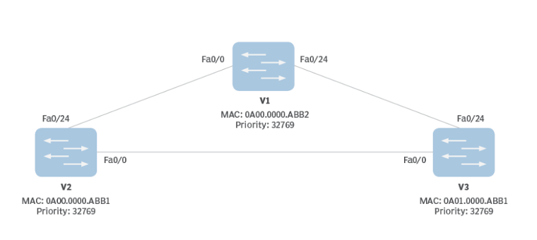

# Basic Network Security

| Challenge Type | Challenge Point |   Time    |
| :------------: | :-------------: | :-------: |
|      QUIZ      |       40        | 5 Minutes |

## Challenge Description

Spanning tree protocol has been configured on each switch in the below diagram. Which switches will become a root bridge and Which switch ports will be blocked in the diagram? (All links have the same cost)

- [ ] Switch V1, Switch V2 port Fa0/24
- [ ] Switch V2, Switch V3 port Fa0/24
- [ ] Switch V3, Switch V1 port Fa0/24
- [ ] Switch V1, Switch V2 port Fa0/0
- [ ] Switch V2, Switch V3 port Fa0/0
